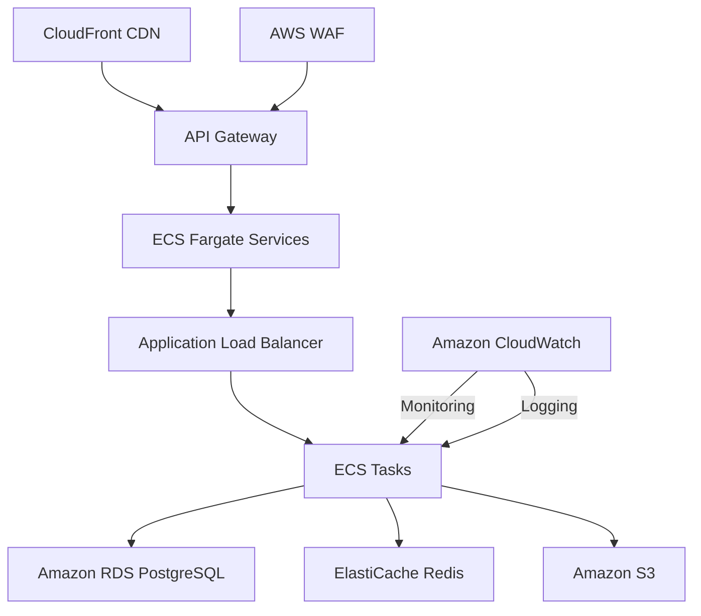

# Samjhadoo Platform - Deployment Plan

## 1. Infrastructure Overview

### 1.1 AWS Architecture


### 1.2 Environment Configuration
- **Production**
  - Region: ap-south-1 (Mumbai)
  - Multi-AZ: Yes
  - Auto-scaling: 4-12 instances
  - Instance Type: t3.xlarge

- **Staging**
  - Region: ap-south-1
  - Multi-AZ: No
  - Auto-scaling: 2-4 instances
  - Instance Type: t3.large

## 2. Database Deployment

### 2.1 RDS Configuration
- **Engine**: PostgreSQL 14
- **Instance**: db.r6g.xlarge
- **Storage**: 500GB GP3
- **Backup**: 7-day retention
- **Read Replicas**: 2 (us-east-1, ap-southeast-1)

### 2.2 Migration Process
1. **Pre-Migration**
   ```bash
   # Create migration
   ./gradlew flywayInfo
   ./gradlew flywayValidate
   ```

2. **During Deployment**
   ```bash
   # Apply migrations
   ./gradlew flywayMigrate -Dspring.profiles.active=prod
   ```

3. **Verification**
   ```sql
   SELECT * FROM flyway_schema_history ORDER BY installed_rank DESC LIMIT 5;
   ```

## 3. Application Deployment

### 3.1 CI/CD Pipeline
```yaml
# .github/workflows/deploy.yml
name: Deploy to Production

on:
  push:
    tags:
      - 'v*'

jobs:
  deploy:
    runs-on: ubuntu-latest
    steps:
      - uses: actions/checkout@v3
      
      - name: Set up JDK 17
        uses: actions/setup-java@v3
        with:
          java-version: '17'
          
      - name: Build with Gradle
        run: ./gradlew clean build -x test
        
      - name: Login to Amazon ECR
        uses: aws-actions/amazon-ecr-login@v1
        
      - name: Build and push Docker image
        env:
          ECR_REGISTRY: ${{ secrets.AWS_ECR_REGISTRY }}
          ECR_REPOSITORY: samjhadoo/backend
        run: |
          docker build -t $ECR_REGISTRY/$ECR_REPOSITORY:${{ github.sha }} .
          docker push $ECR_REGISTRY/$ECR_REPOSITORY:${{ github.sha }}
          
      - name: Deploy to ECS
        uses: aws-actions/amazon-ecs-deploy-task-definition@v1
        with:
          task-definition: task-definition.json
          service: samjhadoo-service
          cluster: samjhadoo-cluster
          wait-for-service-stability: true
```

### 3.2 Blue-Green Deployment
1. Deploy new version to new environment
2. Route 10% traffic to new version
3. Monitor for 15 minutes
4. If no issues, route 100% traffic
5. Keep old version for 1 hour before termination

## 4. Payment Gateway Deployment

### 4.1 Stripe Configuration
```properties
# application-prod.yml
stripe:
  secret-key: ${STRIPE_SECRET_KEY}
  webhook-secret: ${STRIPE_WEBHOOK_SECRET}
  success-url: https://app.samjhadoo.com/payment/success
  cancel-url: https://app.samjhadoo.com/payment/cancel
```

### 4.2 Webhook Setup
```bash
# Register webhook
stripe listen --forward-to https://api.samjhadoo.com/webhooks/stripe

# Test webhook
stripe trigger payment_intent.succeeded
```

## 5. Monitoring and Alerts

### 5.1 CloudWatch Alarms
- **High CPU** > 70% for 5 minutes
- **Memory Usage** > 80% for 10 minutes
- **5xx Errors** > 1% of requests
- **Latency** > 1s (p95)

### 5.2 SLOs
- **Availability**: 99.95%
- **Latency**: < 500ms (p99)
- **Error Rate**: < 0.1%

## 6. Rollback Procedure

### 6.1 Automated Rollback
Triggered by:
- 5 consecutive failed health checks
- Error rate > 5% for 5 minutes
- Deployment timeout (15 minutes)

### 6.2 Manual Rollback
```bash
# Get previous task definition
PREV_TASK_DEF=$(aws ecs describe-task-definition \
  --task-definition samjhadoo-service:$(($LATEST - 1)) \
  --query 'taskDefinition.taskDefinitionArn' \
  --output text)

# Update service
aws ecs update-service \
  --cluster samjhadoo-cluster \
  --service samjhadoo-service \
  --task-definition $PREV_TASK_DEF \
  --force-new-deployment
```

## 7. Communication Plan

### 7.1 Internal Notifications
- **Slack**: #deployments channel
- **Email**: devops@samjhadoo.com

### 7.2 Customer Notifications
- **Email**: support@samjhadoo.com
- **Status Page**: status.samjhadoo.com

## 8. Post-Deployment Verification

### 8.1 Smoke Tests
```bash
# Run smoke tests
./gradlew smokeTest -Dspring.profiles.active=prod

# Verify endpoints
curl -X GET "https://api.samjhadoo.com/health"
curl -X GET "https://api.samjhadoo.com/api/v1/version"
```

### 8.2 Canary Analysis
- Monitor error rates for new deployment
- Compare performance metrics
- Verify payment processing

## 9. Maintenance Windows
- **Database Maintenance**: Sunday 2:00 AM - 4:00 AM IST
- **Deployment Window**: Monday-Thursday 10:00 PM - 12:00 AM IST
- **Emergency Deployments**: Any time with manager approval
