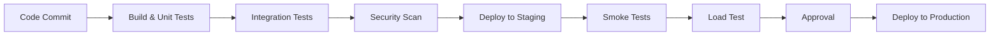

# Samjhadoo Platform - Integration Plan

## 1. Payment Gateway Integration

### 1.1 Payment Processors
- **Primary**: Stripe
- **Fallback**: PayPal
- **Local India**: Razorpay

### 1.2 Integration Flow
1. **Client-Side**
   - Collect payment method via Stripe Elements/PayPal Smart Buttons
   - Tokenize sensitive payment data
   - Send payment intent to backend

2. **Backend Flow**
   ```mermaid
   sequenceDiagram
       Client->>+Backend: Initiate Payment (amount, currency, userId)
       Backend->>+Stripe: Create PaymentIntent
       Stripe-->>-Backend: client_secret
       Backend-->>-Client: Return client_secret
       
       Client->>+StripeJS: confirmPayment(client_secret)
       StripeJS-->>-Client: Payment status
       Client->>+Backend: Update order status
   ```

3. **Webhook Handlers**
   - `payment_intent.succeeded`
   - `payment_intent.payment_failed`
   - `charge.refunded`

## 2. Database Integration

### 2.1 Primary Database (PostgreSQL)
- **Schema**: `samjhadoo_prod`
- **Replication**: 1 Primary, 2 Read Replicas
- **Backup**: Daily snapshots + WAL archiving

### 2.2 Caching Layer
- **Redis Cluster**
  - Session storage
  - Rate limiting
  - Real-time features

### 2.3 Data Migration Strategy
1. Schema migrations via Flyway
2. Zero-downtime deployments
3. Blue-green deployment for critical updates

## 3. Third-Party Services

### 3.1 Email Service
- **Provider**: AWS SES
- **Templates**: Transactional & Marketing
- **Rate Limits**: 50,000 emails/day

### 3.2 File Storage
- **Primary**: AWS S3
- **CDN**: CloudFront
- **Backup**: S3 Cross-Region Replication

## 4. Monitoring & Logging

### 4.1 Application Monitoring
- **APM**: New Relic
- **Metrics**: Prometheus + Grafana
- **Logging**: ELK Stack

### 4.2 Alerting
- **Critical**: PagerDuty
- **Non-Critical**: Slack Alerts

## 5. API Gateway
- **Provider**: AWS API Gateway
- **Rate Limiting**: 1000 req/s per client
- **Caching**: 5-minute TTL for GET requests

## 6. Security

### 6.1 Data Encryption
- **At Rest**: AWS KMS
- **In Transit**: TLS 1.3
- **Secrets**: AWS Secrets Manager

### 6.2 Compliance
- **PCI-DSS**: For payment processing
- **GDPR**: Data protection
- **DPDP**: India data protection

## 7. Deployment Pipeline



## 8. Rollback Plan
1. **Automated Rollback Triggers**
   - 5xx errors > 5%
   - Latency > 1s (p95)
   - Failed health checks

2. **Manual Rollback**
   - One-click rollback to previous version
   - Database rollback scripts

## 9. Communication Plan

### 9.1 Internal Team
- **Slack**: #deployments channel
- **Email**: tech-team@samjhadoo.com

### 9.2 Customers
- **Email**: support@samjhadoo.com
- **Status Page**: status.samjhadoo.com
